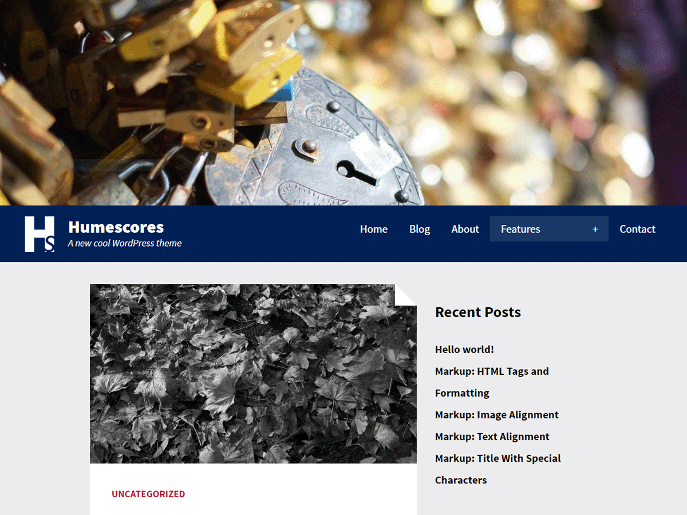
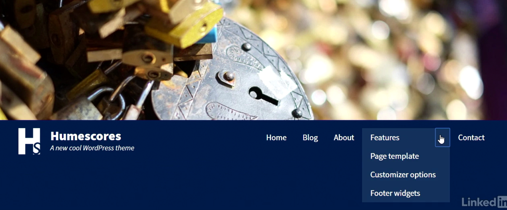
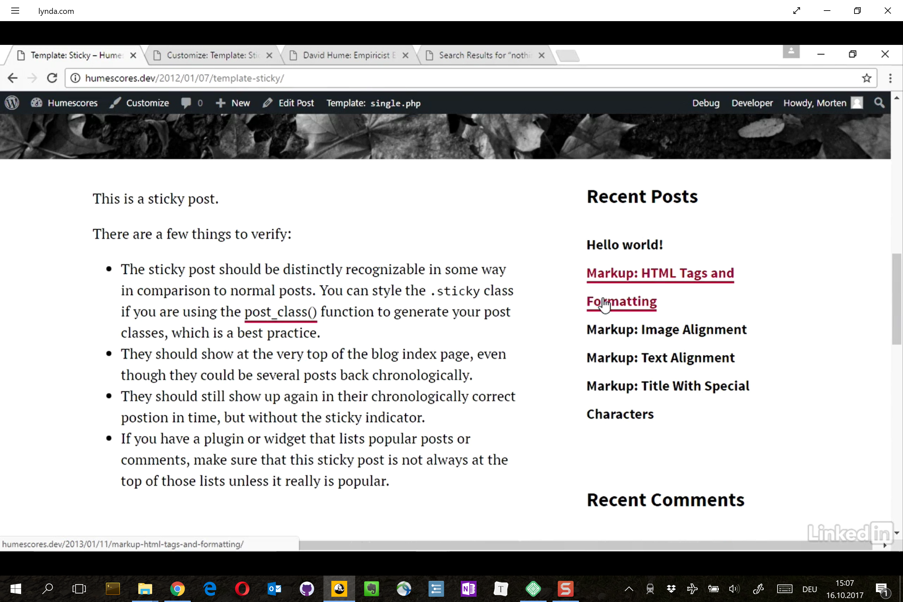
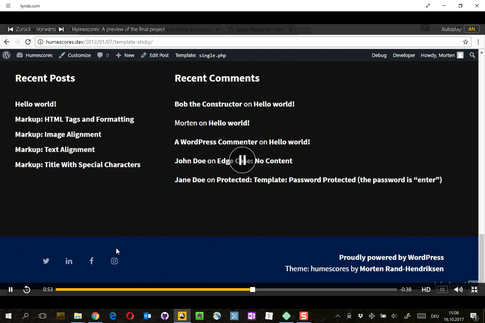

# Humescores: Eine Vorschau auf das vollendete Projekt

Bevor wir loslegen, möchte ich Ihnen kurz das Thema vorstellen, welches wir gemeinsam aufbauen werden.

Humescores ist ein mobile first, responsives Theme mit einem Design, das sich auf grosse Bilder und gut lesbare Typografie konzentriert. Oben auf der Startseite befindet sich ein optionales Headerbild. In der Kopfzeile können Sie ein benutzerdefiniertes Logo und können ein benutzerdefiniertes Menü anzeigen. 

Das Menü ist über Maus, Touch oder Tastatur erreichbar. Auf Index- und Archivseiten werden die Beiträge mit einem optionalen Beitragsbild angezeigt. Bei einzelnen Beiträgen überspannt dieses Bild die gesamte Breite des Bildschirms mit dem darunter liegenden Inhalt.

Das Theme verfügt über eine optionale Seitenleiste, die durch Hinzufügen oder Entfernen von Widgets ein- und ausgeschaltet werden kann.

Wenn die Seitenleiste ausgeschaltet ist, ändert sich das Layout, um den verfügbaren Platz besser ausnutzen zu können. Unten ist ein zweiter optionaler Widgetbereich, und im Footer befindet sich ein optionales Social Media-Menü, in dem automatisch die Social Media- und Site-Icons angezeigt werden, auf die Sie verlinken. 

Alle Links und interaktiven Elemente im Theme haben ein gemeinsames Farbschema, standardmässig ein dunkles Rot, das Sie im Customizer ändern können. Sie können auch die Hintergrundfarbe der Kopf- und Fusszeile sowie die Textfarbe im Customizer ändern.

Seiten haben ein anderes Layout als Beiträge mit einer Sidebar auf der linken Seite, wo Sie Widgets hinzufügen können. Und schliesslich enthält das Theme ein eigenes Template für eine leere Suchergebnis-Seite und ein 404-Template, welches die sechs neuesten Blog-Beiträge zeigt. Ich habe dieses Thema speziell für WordPress erstellt, um so viele fortgeschrittene Features wie möglich in der WordPress Theme-Entwicklung zu präsentieren, also schnallen Sie einen Helm an und machen Sie sich bereit für eine wilde Fahrt.

