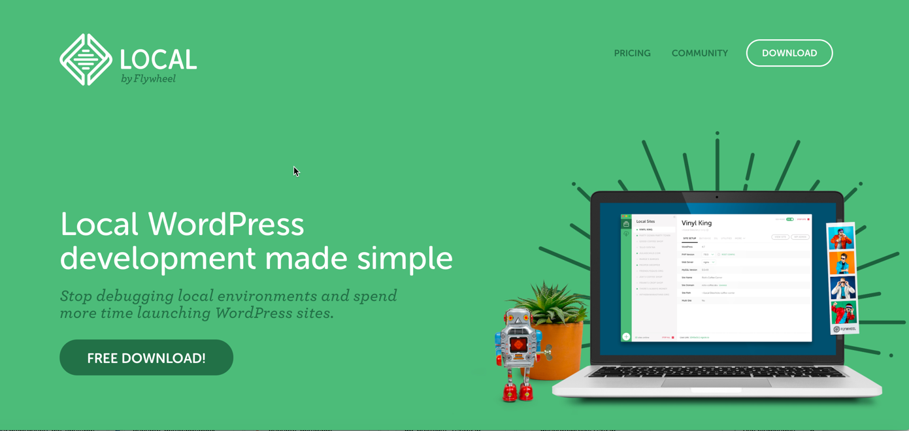
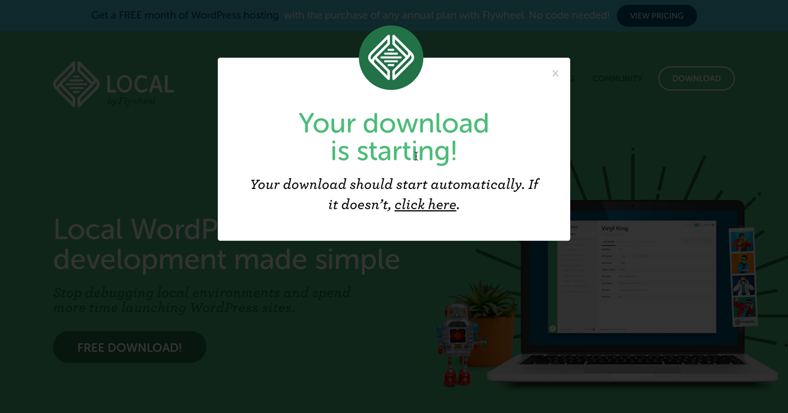
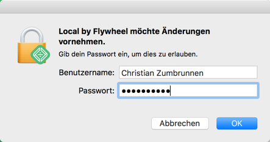
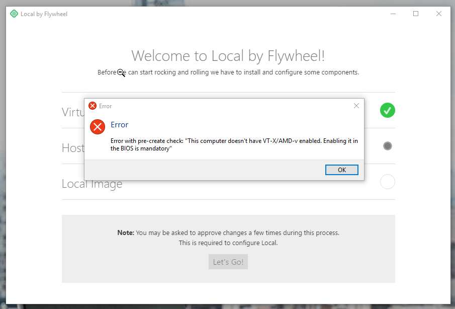
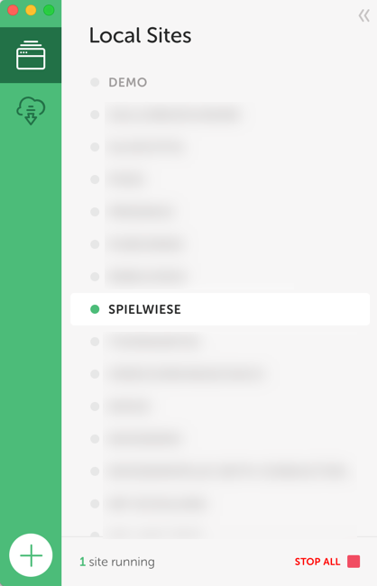
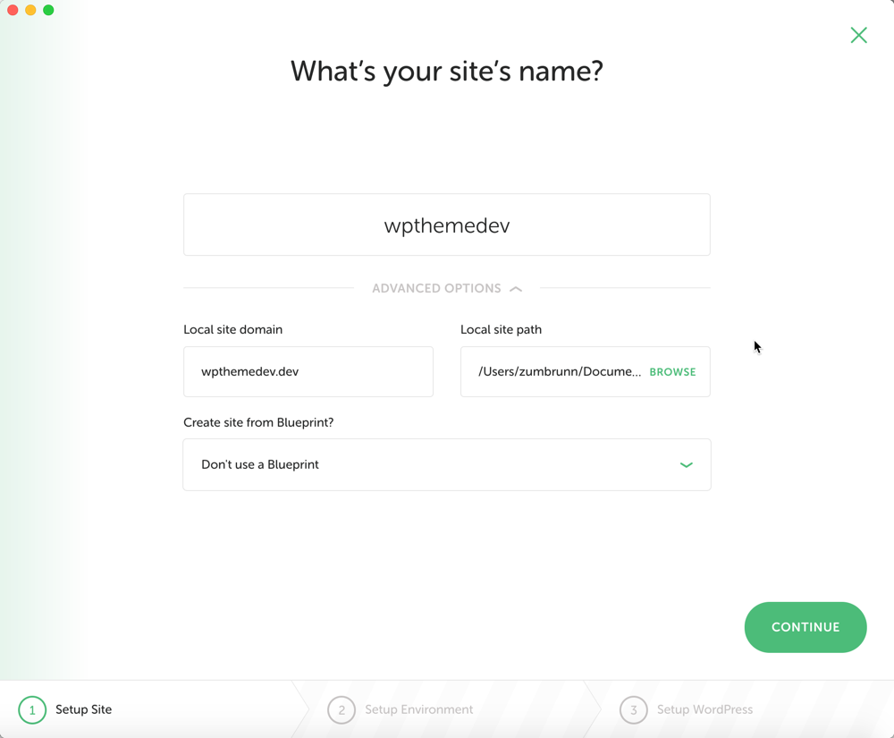
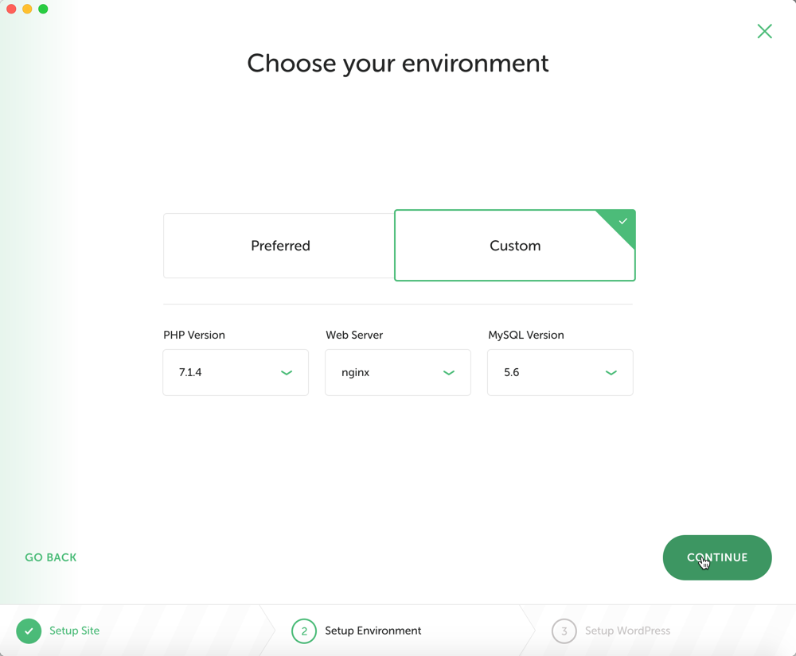
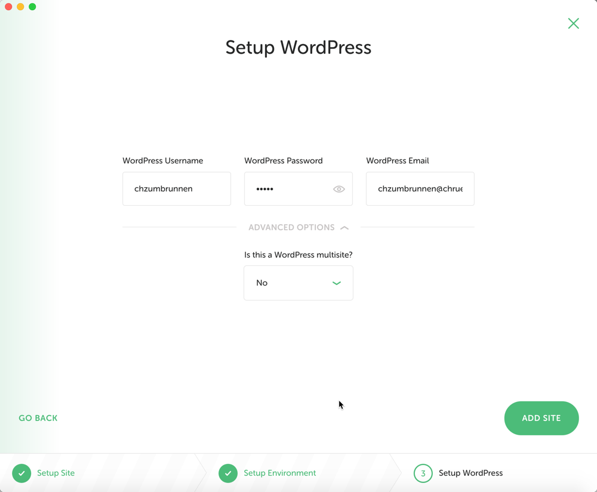
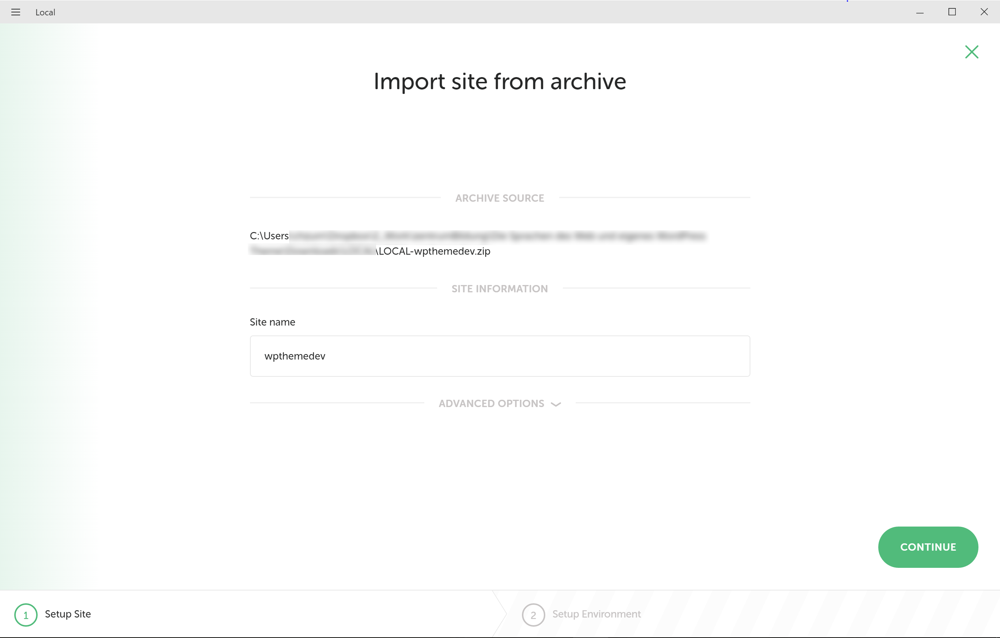

# Die lokale Entwicklungsumgebung einrichten

## LOCAL by Flywheel herunterladen und installieren

LOCAL kann von [local.getflywheel.com](https://local.getflywheel.com/) heruntergeladen werden.
Man muss lediglich die E-Mail-Adresse angeben.

Die Installationsroutine benötigt eine aktive Internetverbindung, da Komponenten, wie [VirtualBox](https://www.virtualbox.org/), bei Bedarf direkt heruntergeladen werden. Mehrmals müssen Sie eine Aufforderung bestätigen um die Änderungen zu erlauben.

Falls Sie eine Fehlermeldung erhalten, dass `VT-X/AMD-v` nicht aktiviert sei, kann LOCAL leider nicht ohne Eingriff ins BIOS des Computers installiert werden. Dazu müssen Sie bei Windows während des Startvorgangs eine Taste bzw. Tastenkombination drücken und im BIOS-Werkzeug Ihres Computers `Intel Virtualization Technology` oder `Virtualization Technology (VTx)` (oder ähnlich) aktivieren. Eine Anleitung (englisch) gibt es im [Community Support Forum von Flywheel](http://local.getflywheel.com/community/t/windows-help-im-getting-a-bios-error-about-vt-x-amd-v-during-installation/426)

Wenn Sie LOCAL installiert haben, werden Sie beim Start mit einer leeren Umgebung begrüsst.

Nun lässt sich mit wenigen Klicks (Start auf Plus unten links) eine neue WordPress Instanz installieren oder eine exportierte Umgebung durch Drag & Drop der .zip-Datei irgendwo auf das LOCAL Fenster importieren.

In beiden Fällen wird man durch einen fast identischen Wizard geleitet.

### Neue Installation

### Import aus einer .zip-Datei

