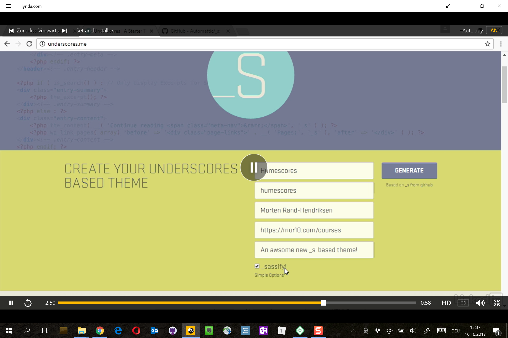
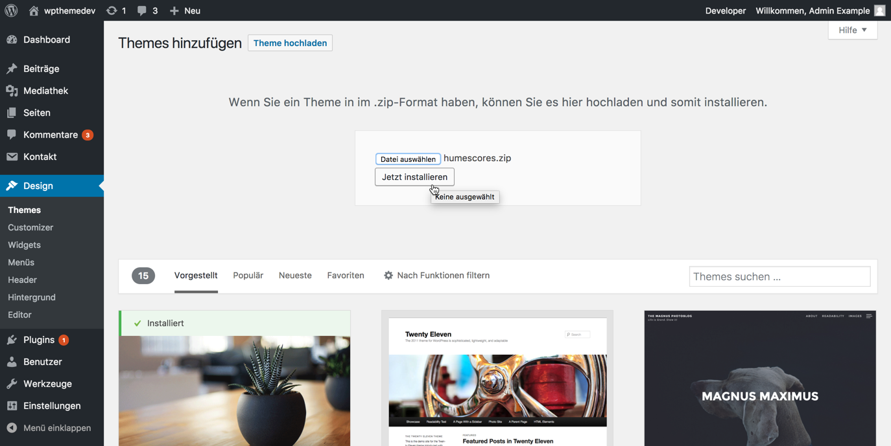
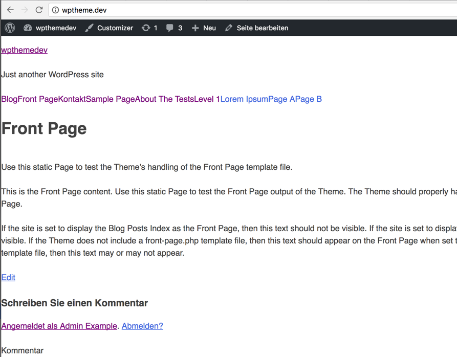

# Das _s (underscores) Starter Theme für WordPress beziehen und installieren

Sobald WordPress auf Ihrem Computer eingerichtet ist und läuft , müssen Sie eine Kopie des Themes Underscores installieren. Underscores ist ein Starter-Thema, das speziell für die Verwendung als Ausgangspunkt für neue benutzerdefinierte Themes entwickelt wurde. Es wird fortlaufend weiter entwickelt und Sie werden oft Änderungen am Code zu sehen bekommen, manchnal täglich. Das bedeutet, dass Sie mit Underscores immer mit dem neuesten und besten WordPress arbeiten können. Das wird oft als der 1000 Stunden Vorsprung bezeichnet. Es bedeutet aber auch, dass Sie Ihren Prozess anpassen müssen, wenn sich das Thema ändert. Kennst du den Ausspruch des Philosophen Heraklit, dass kein Mensch zweimal in denselben Fluss tritt? Es gilt hier, Underscores ist ein Fluss und jedes Mal, wenn Sie in ihn hineingehen oder ihn herunterladen, erleben Sie einen neues Underscores.

Die Version, die Sie herunterladen, wird immer Ihre Nummer 1.0.0 sein.. Underscores wird dann zu Ihrem persönlichen benutzerdefinierten Theme werden. Underscores ist auf der offiziellen Seite von [underscores.me](http://underscores.me/) verfügbar und man kann es auch direkt aus dem GitHub-Repository unter [github.com/automattic/_s](https://github.com/automattic/_s) beziehen. Die Seite underscores.me ist ein Spiegel dessen, was man auf GitHub sieht, also sollte man es einfach direkt von hier anpassen und beziehen.

Nach diesem Kurs haben Sie nun zwei Möglichkeiten. Verwenden Sie die in den Übungsdateien enthaltene Version von Underscores, um Ihren Code exakt mit meinem Code abzugleichen oder verwenden Sie eine neue Kopie von Underscores von underscores.me. Wenn Sie die letztgenannte Option wählen, müssen Sie Ihren Code eventuell ein wenig anpassen, damit er genauso funktioniert wie meiner. Die Funktionalität ist die gleiche, aber kleine Teile des eigentlichen Codes können sich geringfügig unterscheiden. Mit einer neuen Version von Underscores, direkt von underscores.me, erhalten Sie die reale Erfahrung ein neues Theme von Grund auf neu mit Underscores zu erstellen. Nach Abschluss dieses Kurses, ist es genau das, was Sie jedes Mal tun werden, wenn Sie ein neues Theme erstellen.

Wenn Sie zum ersten Mal ein neues Theme erstellen, können Sie auch die mit diesem Kurs mitgelieferte Version verwenden. Wenn Sie bereits einige Erfahrung mit Themes haben oder eine neue Herausforderung suchen, sollten Sie sich ein frisches Exemplar besorgen. Wenn Sie das mitgelieferte Theme verwenden möchten, holen Sie es einfach aus den Übungsdateie oder laden Sie den Startpunkt aus dem [GitHub-Repository](https://github.com/mor10/humescores). Wenn Sie eine neue Kopie verwenden möchten oder ein neues Theme-Projekt starten, gehen Sie zu underscores.me. Legen Sie hier Ihren Theme-Namen fest.

Ich nenne das hier Humescores. Gehen Sie dann zu Erweiterte Optionen und füllen Sie die restlichen Informationen aus. Theme Slug sollte dasselbe sein. Mein Name ist Morten Rand-Hendriksen. Ich werde auf alle meine Kurse verlinken, die ich auf https://mor10.com/courses finden kann und die Beschreibung nenne ich "Ein grossartiges neues Theme basierend auf _s". Schliesslich möchte ich auf die Option `Sassify` klicken, so dass das CSS in Sass-Partial aufgeteilt wird. Und dann kann ich mein neues Thema generieren.

Dadurch wird ein neues Zip-Archiv auf meinen Computer geladen, das humescores.zip genannt wird. Jetzt kann ich zu meiner WordPress-Seite gehen und zum Backend navigieren. Gehen Sie zu Design / Themes und klicken Sie auf `Hinzufügen`, `Theme hochladen` und dann wählen Sie die neu heruntergeladene Datei aus underscores.me aus.

`Jetzt installieren` klicken und das Theme wird entpackt und installiert und ich kann es aktivieren.

Und jetzt, Wenn ich ins Frontend wechsle, sehe ich wie ein kaputtes (bzw. ungestyltes) Theme aussieht und genau das ist es, was wir wollen, wenn wir anfangen. Dies ist ein unbehandeltes Underscores frisch aus der Verpackung.

