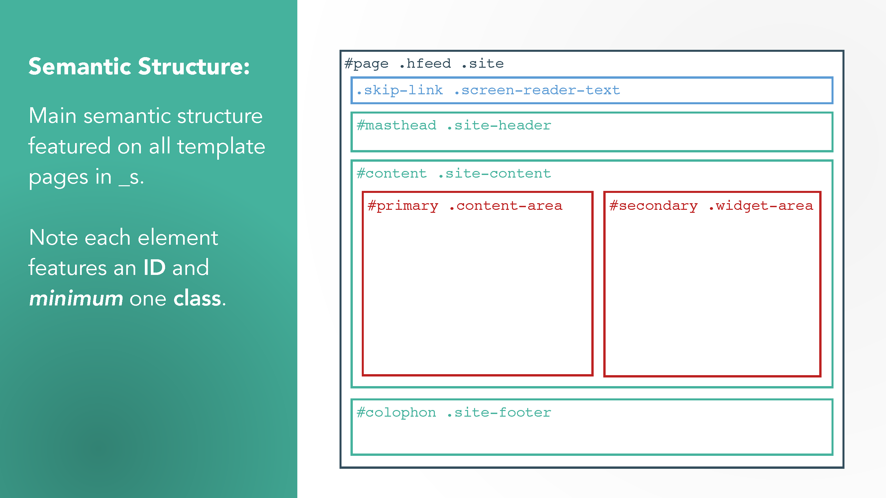

# Die Übungsdateien

## Ex_Files_assets.zip

enthält den Gulp-Prozess sowie je ein PDF für die Struktur der verschiedenen HTML-Container je Seitentyp (_s-container-map.pdf) sowie die Struktur der Sass Partials (_s-sass-partials-map.pdf).

### _s-container-map.pdf

### _s-sass-partials-map.pdf

## Ex_Files_WP_Themes_From_Scratch.zip

Enthält die für das Theme verwendeten Dateien jeweils zum Start (und manchmal Ende der Lektion)

